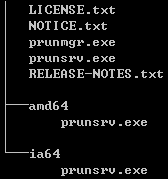

# Java 프로그램의 Windows Service 등록

## 1. 개요
Windows OS를 사용하는 경우, WAS나 별도 개발된 Java 데몬 프로그램 등을 서버 부팅 시 자동으로 실행되도록 구성해야 할 경우가 있다. 이 때, 프로그램 기동 스크립트를 윈도우 시작프로그램에 등록하면 손쉽게 가능하지만 이는 사용자가 서버에 로그인 해야 한다는 제약이 존재한다. 여기서는 OS 부팅 후 사용자 로그인 없이 자동으로 Java 프로그램을 기동하도록 하기 위해 Windows Service로 등록하는 과정에 대해 설명한다. 단, 여기서 설명하는 Java 프로그램은 일회성으로 기동하여 기능하고 스스로 종료하는 형태의 프로그램은 제외하며, 별도의 종료 명령이 있어야만 끝나는 데몬 형태의 프로그램만을 그 대상으로 한다.

## 2. Windows Service와 Java 프로그램
Unix/Linux 계열 OS에는 명령어를 백그라운드로 손쉽게 실행할 수 있지만, Windows OS에서는 프로그램을 백그라운드로 실행하기 위해 Windows Service 또는 작업 스케줄러와 같은 별도의 과정을 거쳐야 한다. 게다가 Windows Service는 Java 프로그램을 직접 실행할 수 없어 별도의 네이티브 바이너리를 거쳐야 하고, 작업 스케줄러는 등록 및 관리하는 과정이 까다로워 사용이 불편하다. 이를 위해 Apache Commons 프로젝트에서는 Java 프로그램을 쉽게 Windows Service로 등록하여 관리할 수 있는 Procrun이라는 프로그램을 제공한다.

## 3. Apache Commons Daemon Procrun
Procrun은 Java 프로그램을 네이티브 프로그램처럼 보이도록 감싸서 Windows Service로 관리할 수 있게 해준다. Procrun을 사용하여 Java 프로그램을 Windows Service로 등록하면 Java 프로그램 실행에 필요한 정보(classpath, main class, jvm option, command-line parameter, program parameter 등)들이 Windows Registry에 저장되므로 필요 시 레지스트리 편집기를 사용하여 쉽게 변경할 수 있다.
* Procrun 홈페이지: <http://commons.apache.org/proper/commons-daemon/procrun.html>
* Procrun 다운로드: <http://www.apache.org/dist/commons/daemon/binaries/windows/>

### 3.1 Procrun 설치
Procrun 다운로드 사이트에서 commons-daemon-1.0.15-bin-windows.zip 파일을 다운로드하여 압축을 해제하면 다음과 같은 파일을 볼 수 있다.

* prunmgr.exe : Procrun Monitor 어플리케이션으로서 Procrun으로 등록된 프로그램의 상태 확인, 기동/중지 같은 단순 기능을 제공
* prunsrv.exe : 32-bit 환경에서 Java 프로그램을 Windows Services로 등록하는 Procrun 어플리케이션
* amd64\prunsrv.exe : 64-bit 환경에서 Java 프로그램을 Windows Services로 등록하는 Procrun 어플리케이션
* ia64\prunsrv.exe : Inter Itanium 64-bit 환경에서 Java 프로그램을 Windows Services로 등록하는 Procrun 어플리케이션

별도의 설치과정이 필요없으며 단순히 압축 해제하여 원하는 위치에서 prunsrv.exe를 실행하면 된다. 이 때, OS에 따라 3개의 prunsrv.exe 파일이 다르므로 환경에 맞는 실행파일을 사용해야 한다. 그리고 사용한 prunsrv.exe 파일은 위치를 옮기거나 삭제하지 말아야 한다.

### 3.2 Procrun으로 Windows Service 등록
Procrun을 사용하는 상세 내용은 Procrun 홈페이지에서 볼 수 있으며, 여기서는 기본적인 사용법을 가이드 한다. Procrun을 통해 Java 프로그램을 Windows Service로 등록하고자 할 때 아래 예시와 같이 prunsrv.exe를 실행한다.
> 예시) prunsrv.exe 실행 예시
> ```
> prunsrv.exe //IS//SampleDaemon --Description="Sample Daemon for Window Service" --Jvm=auto --StartMode=jvm --StopMode=jvm --JvmMs=512 --JvmMx=1024 --JvmOptions=-DSampleApp --Classpath=C:\app\classes;C:\app\lib\* --StartClass=sample.SampleMain --StartParams=start;9999 --StopClass=sample.SampleMain --StopParams=stop;9999
> ```
> * //IS//SampleDaemon : 'SampleDaemon'이라는 서비스명으로 Windows Service에 등록
> * --Description : 등록하는 서비스에 대한 설명
> * --Jvm : 'auto'로 설정하면 레지스트리에서 jvm.dll 위치 자동 검색
>   (JRE가 Installer로 설치되지 않은 경우 jvm.dll에 대한 full-path를 명시해야 함)
> * --StartMode, --StopMode : 'jvm'으로 설정하면 '--Jvm'에서 지정한 jvm.dll을 이용하여 Java 프로그램 실행
> * --JvmMs : 초기 메모리 크기 (MB)
> * --JvmMx : 최대 메모리 크기 (MB)
> * --JvmOptions : -D 또는 -X로 시작하는 JVM 옵션 (여러 개 지정시 ';'로 구분)
> * --Classpath : JVM classpath 지정
> * --StartClass, --StopClass : Java 프로그램 기동/종료 시 사용하는 메인 메소드를 가진 메인 클래스
> * --StartParams, --StopParams : Java 프로그램 기동/종료 시 메인 메소드에 전달할 파라미터 (여러 개 지정시 ';'로 구분)

위와 같이 Windows Service를 등록하면 프로그램 기동 후에 작업 관리자에서 'prunsrv.exe' 프로세스로 나타난다. 그런데, 만일 한 서버 내에 여러 개의 Java 프로그램을 등록한 경우 작업 관리자에서는 모두 동일하게 prunsrv.exe로 보이므로 각 프로그램을 고유하게 구분하기 어렵다. 이러한 경우에는 prunsrv.exe 파일을 구분이 쉽도록 파일명을 변경한 후에 Windows Service 등록하면 해당 변경된 이름으로 작업 관리자에서 쉽게 구분할 수 있다.

이렇게 등록된 Windows Service는 윈도우 서비스 관리 화면에서 확인할 수 있다.
> 윈도우 서비스 관리 화면 : 시작 > 실행 > services.msc

Procrun을 통해 지정한 Java 프로그램 실행 옵션은 윈도우 레지스트리에서 확인 및 수정이 가능하다.
> 32-bit : HKEY_LOCAL_MACHINE\SOFTWARE\Apache Software Foundation\ProcRun 2.0
>
> 64-bit : HKEY_LOCAL_MACHINE\SOFTWARE\Wow6432Node\Apache Software Foundation\ProcRun 2.0

서비스의 기동/중지, 시작 유형 변경 등은 윈도우 서비스 관리 화면 또는 명령어를 통해서 가능하다.
> 윈도우 서비스 명령어 참조 : <https://technet.microsoft.com/ko-kr/library/cc754599(v=ws.10).aspx>

### 3.3 Windows Service 삭제
Procrun을 통해 등록된 Windows Service는 다시 Procrun을 통해 삭제할 수 있으며 윈도우 서비스 명령어를 이용할 수도 있다.

Procrun을 통한 Windows Service 삭제는 다음과 같이 한다.
> ```
> prunsrv.exe //DS//SampleDaemon
> ```
> * //DS//SampleDaemon : 'SampleDaemon'이라는 이름으로 등록된 윈도우 서비스를 삭제한다.

윈도우 서비스 명령어를 통한 Windows Service 삭제는 다음과 같이 한다.
> ```
> sc delete SampleDaemon
> ```
> * sc delete SampleDaemon : 'SampleDaemon'이라는 이름으로 등록된 윈도우 서비스를 삭제한다.
