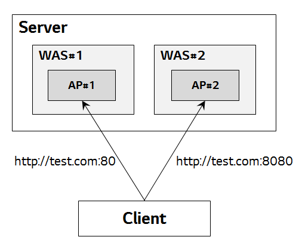
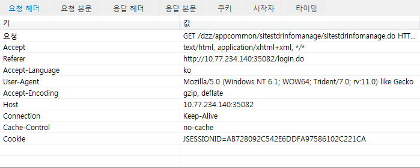
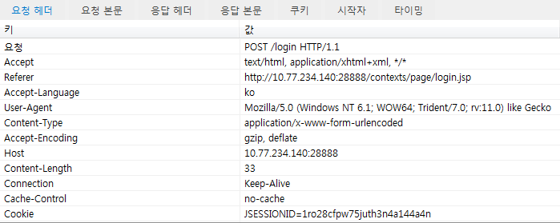
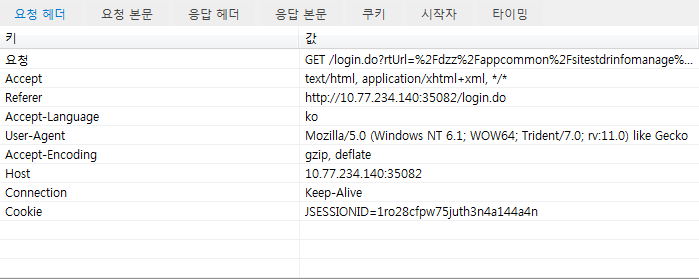

# 동일 도메인 WAS 인스턴스간 HTTP 세션 충돌 방지

## 1. 개요
동일한 도메인명을 사용하는 여러 WAS 인스턴스가 서로 다른 서비스를 제공하는 경우가 있다. 이 때, 각 인스턴스에서 동작하는 서비스 간에 HTTP 세션이 충돌하여 하나의 서비스에 접근하면 다른 서비스에서 로그아웃 되는 현상이 발생할 수 있다. 여기서는 이에 대한 원인을 분석하고 해결방안을 제시하고자 한다.

## 2. 분석
### 2.1 문제 상황
개발/테스트/운영 환경을 구성할 때, 하나의 물리적인 서버 내에 필요에 따라 상호 연관성이 없는 WAS 인스턴스를 여러 개 구성할 수 있다. 이 때, 보통은 각 인스턴스 간에 구분이 용이하도록 서비스 포트를 분리하여 구성하게 된다. 이러한 상황에서 클라이언트가 2개 이상 인스턴스에 접근하게 되면 먼저 접근한 시스템의 HTTP 세션이 만료되는 것 같은 현상이 발생하는 경우가 있다.



위의 그림에서 WAS#1과 WAS#2이 서로 독립적인 인스턴스라고 하면, 클라이언트가 동일한 도메인명 또는 IP주소를 사용하여 AP#1과 AP#2에 모두 로그인하면(예: 동일 웹브라우저에서 2개의 탭으로 각 AP에 로그인 하는 경우) 서비스 포트가 다름에도 불구하고 먼저 로그인한 시스템의 HTTP 세션을 잃게되어 로그아웃한 상태처럼 되어버린다.

### 2.2 현상
2개의 테스트용 인스턴스를 구성하여 웹브라우저의 개발자도구를 통해 HTTP 요청/응답에 어떠한 변화가 발생하는지 확인해보도록 한다.

(1) 테스트AP#1에 로그인  


(2) 테스트AP#2에 로그인 (동일 웹브라우저의 다른 탭 사용)


위의 두 그림에서 HTTP 세션ID를 보관하는데 사용되는 쿠키값(JSESSIONID)이 서로 다른 것을 볼 수 있다. 이 상황에서 테스트AP#1에 접근한 탭을 새로고침하면 아래와 같이 나타난다.

(3) 테스트AP#1 화면 새로고침

단순히 새로고침만 했을 뿐인데 쿠키의 JSESSIONID값이 그림 (2)와 동일하게 바뀐 것을 확인할 수 있다. 즉, 테스트AP#1에서 유지하던 세션ID 정보를 잃어버린 것이다. AP#2에 로그인하면서 AP#1에서 생성해놓은 세션ID가 AP#2의 세션ID로 덮어씌워지고, 결국 클라이언트가 새로고침하는 시점에는 AP#1 접근에 필요한 세션ID가 없으므로 로그인되지 않은 것처럼 인식된다.

### 2.3 원인
Java 서블릿 엔진에서는 HTTP 세션을 추적하기 위해 클라이언트 쿠키에 'JSESSIONID'라는 이름으로 HTTP 세션ID를 저장하도록 유도한다. 이 때, 쿠키에 값을 저장하는 기준은 도메인명(domain)과 경로(path)이다. 도메인명은 포트번호를 제외한 부분으로서 서비스 포트가 다른 것은 쿠키에 아무런 영향이 없다. 그런데, 앞서 테스트한 상황에서 도메인명은 서버IP 주소를 사용하여 동일하므로 남은 것은 경로이다. AP#1과 AP#2가 WAS 인스턴스에 디플로이될 때 동일한 컨텍스트 경로(예: '/')를 사용한다면, WAS는 쿠키에 JSESSIONID 생성 시 해당 경로를 사용하게 되고 위와 같이 나중에 생성된 JSESSIONID 값으로 덮어씌워지게 된다. 결국, 이러한 문제가 발생하는 원인은 쿠키의 특성과 어플리케이션의 디플로이 구조에 따른 것이라고 볼 수 있다.

## 3. 해결 방안
### 3.1 도메인명 분리
가장 간단한 방법은 각 WAS 인스턴스가 서비스하는 도메인명을 분리하는 것이다. 쿠키는 도메인명이 다르면 별도로 생성되므로 충돌 위험이 사라진다. 개발/테스트 환경과 같이 Public 도메인명을 부여하기 어려운 경우에는 클라이언트 PC의 hosts 파일에 강제로 도메인명을 지정하는 방법이 있다.
도메인명 분리는 단순한 서버 분리와는 다르다. 2대의 서버에 각각 독립적인 WAS 인스턴스를 구성하더라도 WAS 앞 단에 Web Server를 구성하는 경우, Web Server에서 처리하는 도메인명을 분리하지 않고 포트 기반 가상호스트를 사용하면 여전히 쿠키 충돌 문제가 발생한다.

### 3.2 컨텍스트 경로 분리
각 WAS 인스턴스에 디플로이되는 어플리케이션의 컨텍스트 경로를 분리하는 방법이 있다. 즉, AP#1의 컨텍스트 경로를 루트('/')로 설정한다면 AP#2의 컨텍스트 경로는 '/ap2'로 하는 형태로 다르게 디플로이 하는 것이다. 이렇게 하면 경로에 따라 별도 쿠키가 생성되어 충돌 위험이 사라진다. 단, 이 경우 컨텍스트 경로가 변경됨으로써 어플리케이션에 영향(URL 매핑, View 내부의 링크 등)이 있을 수 있으므로 검토가 필요하다.

### 3.3 HTTP 세션ID를 저장하는 쿠키명 분리
어플리케이션 구조상 도메인명이나 컨텍스트 경로를 변경할 수 없다면, 세션ID를 저장하는 쿠키명을 각각 다르게 설정하여 해결할 수 있다. 즉, AP#1에서 세션ID를 기본 이름인 'JSESSIONID'로 저장한다면 AP#2에서는 세션ID를 'AP2SESSIONID'와 같이 다르게 설정하는 것이다. 단, 이 경우에는 주의해야 할 점이 2가지 있다.
* 세션ID를 제외한 쿠키명 충돌
  - 세션ID 외에 어플리케이션에서 쿠키에 직접적으로 설정하는 값이 있을 경우, 이들 모두에 대해 쿠키명이 충돌하지 않도록 설정해야 한다. 즉, AP#1에서 'tempData'라는 이름의 쿠키를 사용한다면 AP#2에서는 'tempData'라는 쿠키명을 사용하지 않아야 한다.
* 모든 쿠키값 전송
  - 도메인명과 경로가 동일하면 AP#1과 AP#2는 같은 쿠키를 공유하게 된다. 세션ID를 저장하는 쿠키명을 분리하더라도 HTTP의 특성상 해당 쿠키에 존재하는 모든 값들이 서버와 통신하는 시점에 모두 전송된다. 즉, AP#2와 통신할 때도 AP#1에서 설정한 쿠키값들이 같이 전송되는 것이다. 이것은 쿠키에 저장된 값이 많을 경우 네트워크 구간에서 오버헤드가 될 수 있으므로 가급적 쿠키 사용량을 최소화할 필요가 있다.

세션ID를 저장하는 쿠키명을 별도로 지정하는 것은 다음 3가지 방안으로 가능하다.
* Deployment Descriptor에서 지정하는 방법 (Servlet 3.0 이상에서만 가능)
  - 웹어플리케이션의 Deployment Descript인 web.xml 파일에서 아래와 같은 형태로 설정 가능하다.
```
<session-config>
    <cookie-config>
        <name>CUSTOM_SESSIONID</name>
    </cookie-config>
</session-config>
```
* Servlet Listener를 작성하여 프로그램 상에서 지정하는 방법 (Servlet 3.0 이상에서만 가능)
  - 웹어플리케이션에 별도의 Listener를 개발하여 context 초기화 이벤트 발생 시 원하는 쿠키명을 설정한다.
  - web.xml 파일에 설정하는 방식과 동일한 효과이다.
```
public void contextInitialized(ServletContextEvent servletContextEvent) {
    ServletContext servletContext = servletContextEvent.getServletContext();
    SessionCookieConfig scc = servletContext.getSessionCookieConfig();
    scc.setName("CUSTOM_SESSIONID");
}
```
* WAS에서 지정하는 방법
  - WAS 제품에서 제공하는 방식에 따라 설정 가능하며, 웹어플리케이션 내에서 지정하는 것보다 우선한다.
  - Servlet 3.0 미만을 사용하는 경우 웹어플리케이션 단위로 지정할 수 없으므로 반드시 이 방법으로 설정해야 한다.
  - Tomcat 설정 예시 (<Context> 태그에 'sessionCookieName' 속성으로 설정)
```
<Context docBase="/app/webapp" path="" useHttpOnly="true" sessionCookieName="CUSTOM_SESSIONID" />
```
