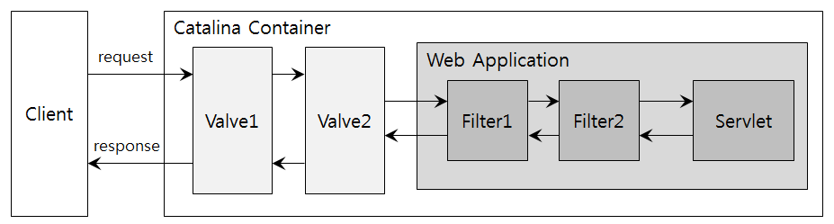
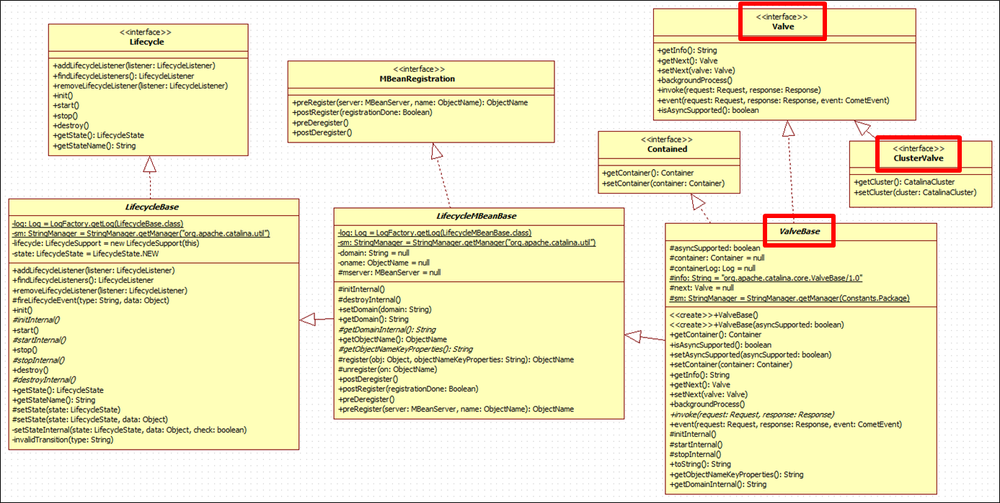

# Tomcat Valve 이해하기

## 1. 개요
Tomcat에서 제공하는 Valve 컴포넌트에 대해 이해하고 Custom Valve를 작성해본다.

## 2. Valve란?
### 2.1 정의
* Catalina 컨테이너(Engine, Host, Context)의 요청 처리 파이프라인 상에서 특정 기능을 수행하기 위해 추가될 수 있는 컴포넌트
* <http://tomcat.apache.org/tomcat-7.0-doc/config/valve.html>

### 2.2 특징
* Tomcat 4 버전부터 추가된 컴포넌트로서 Tomcat에 들어오는 각 요청들에 대한 전처리 수행
* Servlet Filter와 유사한 역할이나, Filter가 웹어플리케이션에 한정된 반면에 Valve는 Catalina 컨테이너 레벨에서 동작
* Valve와 Servlet Filter가 적용된 구성

* Tomcat에 기본으로 내장된 Valve가 다수 존재하며, Custom Valve를 개발하여 추가 가능
* Valve로 할 수 있는 작업
  - request/response에 대한 일부 속성값 조회/변경
  - request/response에 대한 wrapper 생성
  - 자체적으로 response 생성 후 요청 처리 파이프라인 중단
* Valve로 하면 안되는 작업
  - 파이프라인 처리 흐름을 결정하는데 사용된 속성값 변경 (예: Context에 추가된 Valve에서 request 객체의 host 속성 변경)
  - 자체적으로 생성한 response를 현재 파이프라인 상의 후속 컴포넌트에 전달
  - request body 접근 시 wrapper를 생성하지 않은 채로 request input stream 핸들링
  - 현재 파이프라인 상에서 생성된 response에 대해 HTTP 헤더 변경
  - 현재 파이프라인 상에서 생성된 response에 대해 response output stream 핸들링
* <http://tomcat.apache.org/tomcat-7.0-doc/api/org/apache/catalina/Valve.html#invoke(org.apache.catalina.connector.Request,%20org.apache.catalina.connector.Response)>

## 3. 내장 Valve
### 3.1 Tomcat7 내장 Valve
| Valve명 | Class명 | 적용 대상 | 기능 |
|--------|---------|----------|-----|
| Access Log | org.apache.catalina.valves.AccessLogValve | Engine, Host, Context | access 로그 생성 |
| Extended Access Log | org.apache.catalina.valves.ExtendedAccessLogValve | Engine, Host, Context | W3C 로그파일포맷에 따른 로그 생성 |
| Remote Address Filter | org.apache.catalina.valves.RemoteAddrValve | Engine, Host, Context | 정규표현식을 활용한 IP 기반 클라이언트 접근 제어 |
| Remote Host Filter | org.apache.catalina.valves.RemoteHostValve | Engine, Host, Context | 정규표현식을 활용한 호스트명 기반 클라이언트 접근 제어 |
| Remote IP | org.apache.catalina.valves.RemoteIpValve | Engine, Host, Context | mod_remoteip 모듈을 사용하는 프록시에 의해 요청 헤더에 추가된 클라이언트 IP 및 호스트명 처리|
| SSL | org.apache.catalina.valves.SSLValve | Engine | mod_proxy_http 모듈을 통해 프록시와 Tomcat간 SSL 적용시 SSL 정보 처리 |
| Single Sign On | org.apache.catalina.authenticator.SingleSignOn | Host | 같은 호스트에 연결된 어플리케이션간 SSO 처리 |
| Basic Authenticator | org.apache.catalina.authenticator.BasicAuthenticator | Context | RFC 2617 HTTP BASIC Authentication 처리 |
| Digest Authenticator | org.apache.catalina.authenticator.DigestAuthenticator | Context | RFC 2069 HTTP DIGEST Authentication 처리 |
| Form Authenticator | org.apache.catalina.authenticator.FormAuthenticator | Context | Servlet 2.2 FORM BASED Authentication 처리 |
| SSL Authenticator | org.apache.catalina.authenticator.SSLAuthenticator | Context | SSL 인증서 기반 Authentication 처리 |
| SPNEGO Authenticator | org.apache.catalina.authenticator.SpnegoAuthenticator | Context | SPNEGO/Kerberos 기반 Authentication 처리 |
| Error Report Valve | org.apache.catalina.valves.ErrorReportValve | Host | HTML 에러 페이지 생성 |
| Crawler Session Manager | org.apache.catalina.valves.CrawlerSessionManagerValve | Engine, Host, Context | Web Crawler가 다수 요청 발생시 세션이 1개만 존재하도록 관리 |
| Stuck Thread Detection | org.apache.catalina.valves.StuckThreadDetectionValve | Engine, Host, Context | 수행시간이 긴 쓰레드 감지하여 로깅 및 인터럽트 |
| Semaphore | org.apache.catalina.valves.SemaphoreValve | Engine, Host, Context | 동시 요청을 처리할 쓰레드 개수 제한 |
| Replication | org.apache.catalina.ha.tcp.ReplicationValve | Engine, Host, Context | 클러스터 환경에서 세션 변경시 replication |
| Jvm Route Binder | org.apache.catalina.ha.session.JvmRouteBinderValve | Host | 클러스터 환경에서 mod_jk 모듈을 통해 프록시와 연결된 경우 fail-over 발생시 JSESSIONID를 변경하여 라우팅 |
| Cluster Single Sign On | org.apache.catalina.ha.authenticator.ClusterSingleSignOn | Host | 클러스터 환경에서 각 노드간 SSO 처리 |

### 3.2 Valve 설정 예시
* server.xml 파일에서 적용할 Valve를 대상 컨테이너 하위에 설정한다.
* Host에 Access Log Valve 설정 및 Context에 Custom Valve 설정 예
> ```
> <Host appBase="webapps" autoDeploy="true" name="localhost" unpackWARs="true">
>   <!-- Access log processes all example.
>        Documentation at: /docs/config/valve.html
>        Note: The pattern used is equivalent to using pattern="common" -->
>   <Valve className="org.apache.catalina.valves.AccessLogValve" directory="logs" pattern="%h %l %u %t &quot;%r&quot; %s %b" prefix="localhost_access_log" suffix=".txt"/>
>   <Context docBase="tomcat_test" path="/" reloadable="false" source="org.eclipse.jst.jee.server:tomcat_test">
>     <Valve className="custom.valve.ContextReloadValve" />
>   </Context>
> ```

## 4. Custom Valve 개발
### 4.1 개발 순서
1. Tomcat에서 제공하는 인터페이스 구현 또는 추상 클래스 상속 후 추상 메소드 구현
  * 인터페이스 구현 : org.apache.catalina.Valve 인터페이스 구현
  * 추상 클래스 상속 : org.apache.catalina.valves.ValveBase 클래스 상속 후 추상 메소드인 invoke() 구현
  * 클러스터용 Valve 개발을 위해서는 org.apache.catalina.ha.ClusterValve 인터페이스도 구현 필요
2. 개발된 Valve를 jar로 아카이브 생성하여 ${CATALINA_HOME}/lib 또는 ${CATALINA_BASE}/lib 경로에 배포
3. server.xml 파일에서 적용 대상 컨테이너에 xml 설정 추가

### 4.2 관련 Class Diagram


### 4.3 개발 예시
특정 URL 호출 시 Tomcat의 Context를 reloading하는 Custom Valve 개발
* [Valve 소스]
> ```
> public class ContextReloadValve extends ValveBase { // ValveBase 추상 클래스를 상속하여 invoke() 메소드 구현
>     private String path = "/reload";    // Reload URI
>     public void setPath(String path) {    // Valve 설정 시점에 Reload URI를 지정할 수 있도록 setter 제공
>         this.path = path;
>     }
>     @Override
>     public void invoke(Request request, Response response)  throws IOException, ServletException {
>         String requestUri = request.getRequestURI();
>         String reloadUri = request.getContextPath() + this.path;
>         // container는 외부에서 주입되므로 런타임에 타입 체크 필요
>         if (super.container instanceof Context && requestUri.equals(reloadUri)) {
>             reload(response);    // Reload 요청 – Context Reload 후 응답 처리
>         } else {
>             getNext().invoke(request, response);    // Reload 요청이 아니면 현재 파이프라인 상의 다음 컴포넌트 수행
>         }
>     }
>     private void reload(Response response) throws IOException {
>         ((Context) super.container).reload();
>         response.setContentType("text/plain; charset=UTF-8");
>         PrintWriter writer = response.getWriter();
>         writer.println("Context Reloaded!");
>     }
> }
> ```

* [Valve 설정]
> ```
> <Context docBase="/test_app“ path="/“ reloadable="false“>
>   <Valve className="custom.valve.ContextReloadValve“ path="/customReload" />
> </Context>
> ```
